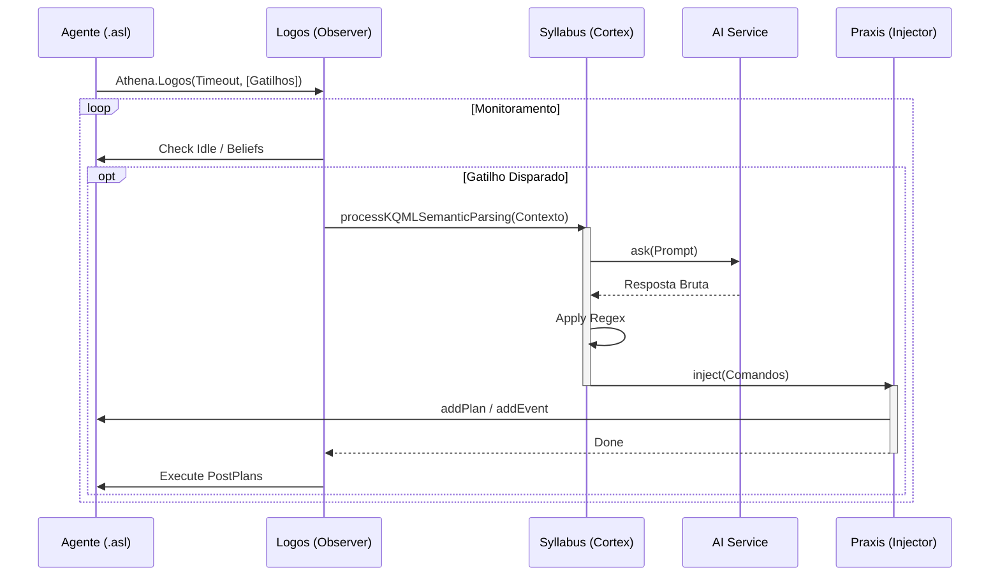

# Fluxos de Execução do Framework Athena

Esta documentação detalha o ciclo de vida da "consciência" do agente e a orquestração entre os componentes **Logos**, **Syllabus** e **Praxis**.

## 1. Fluxo de Inicialização (Bootstrapping)
Prepara o "cérebro" do agente, carregando o contexto na memória da LLM e iniciando os monitores.

1.  **Jason:** Inicia e executa o plano `!start`.
2.  **Identidade:** Agente chama `.addPersona(...)` e `.reflectPlans`.
    *   *Athena:* Carrega o código fonte `.asl` e o texto da persona na memória Java.
3.  **Consciência:** Agente chama `.startThink(Modelo)`.
    *   *Athena:* Inicializa o `AIService` (Lazy Load).
    *   *Ollama:* Recebe o contexto inicial. Retorna vetor de memória.
    *   *Athena:* Adiciona a crença `incorporated` ao agente.
4.  **Autonomia:** Agente configura os componentes.
    *   `Athena.Logos(...)`: Inicia a thread de monitoramento.
    *   `Athena.Praxis.nap(...)`: Inicia a thread de limpeza de memória.

## 2. Fluxo Principal: O Ciclo Cognitivo (The Heartbeat)
Este é o loop autônomo gerenciado pelo **Logos**.

1.  **Monitoramento (Logos):**
    *   Verifica a cada ciclo: `Tempo Ocioso > Timeout` OU `Crença Gatilho Ativa`.
    *   Se verdadeiro e `Syllabus` não estiver ocupado: Dispara processo.
2.  **Processamento (Syllabus.processKQMLSemanticParsing - Thread B):**
    *   Recebe snapshot do estado (Persona, Planos, Input).
    *   **Verificação de Persona:** Se mudou, reinicializa a sessão do Ollama.
    *   **Geração:** Envia prompt para o Ollama.
    *   **Tradução:** Recebe texto bruto e aplica Regex Estrito (filtra apenas comandos KQML).
3.  **Injeção (Praxis):**
    *   Recebe a lista de comandos limpos.
    *   Valida sintaxe Jason.
    *   Adiciona anotação `[source(athena), rationale("cognitive_inference")]`.
    *   **Injeta** na Base de Crenças ou Biblioteca de Planos do agente.
4.  **Pós-Processamento (Logos):**
    *   Executa planos definidos em `postPlans` (ex: `!atualizar_interface`).

## 3. Fluxos Alternativos

### A. Interação Direta (`.ask_llm`)
Usado quando o agente precisa de uma resposta imediata e bloqueante, sem passar pelo ciclo autônomo.
1.  Agente chama `.ask_llm("Pergunta", Resposta)`.
2.  Athena envia direto ao `AIService`.
3.  Resposta é unificada na variável `Resposta`.
4.  **Nota:** Não passa pelo Regex estrito do Syllabus nem pelo Praxis. Carrega apenas Persona e os Planos, não é um tradutor para KQML como o Syllabus.

### B. Gestão de Memória (Praxis)
O Praxis atua como um coletor de lixo para evitar que o agente fique lento com muitos planos gerados.

*   **Modo Nap (Crítico):**
    *   Monitora RAM do Sistema (Linux `/proc/meminfo`).
    *   Se `RAM > Threshold`: Executa GC agressivo. Se falhar, mata o processo Ollama.
*   **Modo Collector (Preventivo):**
    *   A cada `N` minutos, verifica planos com `source(athena)`.
    *   Mantém os `Top X` mais usados.
    *   Remove o restante da `PlanLibrary`.

## 4. Diagrama de Sequência Simplificado

